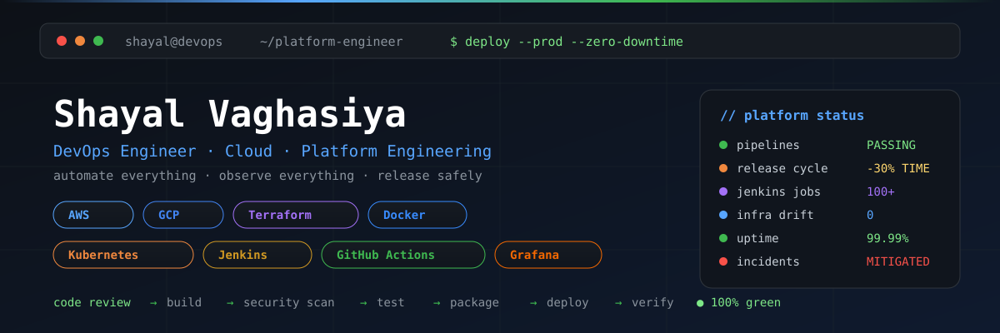
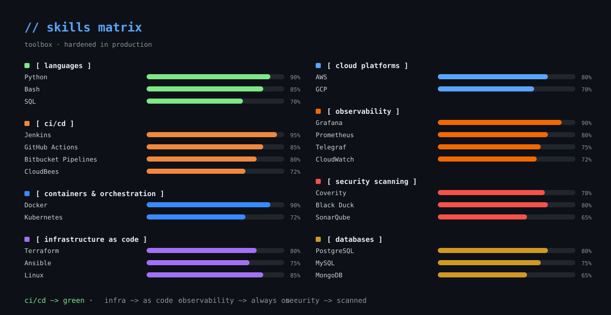

<p align="center">
  
</p>

<p align="center">
  <a href="https://github.com/shayalvaghasiya">
    
  </a>
  <a href="https://linkedin.com/in/shayalvaghasiya">
    
  </a>
  <a href="mailto:shayalvaghasiya@gmail.com">
    
  </a>
</p>

---

```
┌──────────────────────────────────────────────────────────────┐
│  USER         shayalvaghasiya                                │
│  ROLE         devops · cloud · platform engineering          │
│  REGION       global              TZ             UTC         │
│  STATUS       ● available for builds                         │
│  PIPELINES    ● green             OBSERVABILITY   ● on       │
└──────────────────────────────────────────────────────────────┘
```

## 🚀 About Me

DevOps Engineer focused on **CI/CD automation, distributed build and release pipelines, containerization, infrastructure automation, and observability** — with a strong emphasis on platform reliability, scalability, and operational excellence.

I build and maintain on-premise CI/CD orchestration platforms, automate HIL (Hardware-in-the-Loop) testing and release workflows, and keep software delivery fast, safe, and observable. Currently deep-diving into **AWS, Terraform, Kubernetes, GitOps, and observability** — because a platform only becomes legendary when it survives production.

## 🧩 Skills Dashboard

<p align="center">
  
</p>

| Category | Toolkit |
| --- | --- |
| **Languages** | Python, Bash, SQL |
| **CI/CD** | Jenkins, GitHub Actions, CloudBees, Bitbucket Pipelines |
| **Containers & Orchestration** | Docker, Kubernetes |
| **Infrastructure as Code** | Terraform, Ansible, CloudFormation (learning) |
| **Observability** | Grafana, Prometheus, Telegraf, CloudWatch |
| **Cloud Platforms** | AWS, GCP |
| **Security Scanning** | Coverity, Black Duck, SonarQube |
| **Databases** | PostgreSQL, MySQL, MongoDB |
| **APIs & Tooling** | Git, GitHub, Bitbucket, Linux, Nginx, Jira, Postman |

<details>
<summary><b>🔥 More detailed tech stack</b></summary>


</details>

---

## 💼 What I do every day

- **CI/CD pipelines** — Jenkins, GitHub Actions, and build automation that keeps deploys green
- **Release engineering** — multi-platform firmware/driver builds with 30% shorter release cycles
- **Container orchestration** — Docker and Kubernetes for portable, scalable workloads
- **Infrastructure as Code** — Terraform and Ansible for repeatable, reviewable infrastructure
- **Cloud platforms** — AWS and GCP for services that scale without drama
- **Observability** — Grafana, Prometheus, Telegraf, and CloudWatch to keep the dashboard honest
- **Security scanning** — Coverity, Black Duck, and SonarQube baked into every pipeline
- **Automation** — Python and Bash to eliminate manual work and reduce toil

---

## 💼 Experience

### Wipro Limited · Client: NXP Semiconductors
**Software Engineer** — Aug 2025 – May 2026

- Developed an on-premise CI/CD orchestration platform to automate Hardware-in-the-Loop (HIL) testing and release workflows.
- Optimized end-to-end release pipelines for multi-platform firmware and driver builds, reducing release cycle time by **30%**.
- Standardized and maintained **100+ Jenkins pipelines** for pre-merge validation, post-merge verification, and cross-platform release builds.
- Deployed an infrastructure monitoring and observability stack with **Telegraf and Grafana** to track CI/CD system health, pipeline throughput, and job queue metrics.

### NXP Semiconductors, Pune
**Software Intern** — Jul 2024 – Jun 2025

- Built a Python-based pre-merge validation framework orchestrating static analysis and sanity checks for firmware and driver integration workflows.
- Automated log parsing and failure classification, cutting root cause identification time by **60%**.
- Refactored legacy scripts into modular, containerized components, standardizing build artifact reproducibility across development and CI environments.
- Integrated **Coverity and Black Duck** for static code analysis and open-source security scanning, with automated daily reporting and **100% license compliance**.

---

## 📦 Projects

### Scalable & Secure 3-Tier Architecture on AWS

- Designed and deployed a highly available, scalable AWS microservices platform using **Terraform** and **GitHub Actions**.
- Established observability with **CloudWatch dashboards**, centralized logging, metrics, and **ECS Container Insights**, improving monitoring and troubleshooting efficiency.

---

## 🎓 Certifications & Education

- **Google Cloud Certified: Associate Cloud Engineer**
- **AWS Certified Cloud Practitioner**
- **M.Tech in Computer Science & Engineering (Data Science)** — Nirma University, Ahmedabad (2023 – 2025), CGPA 8.55/10
- **B.E. in Computer Engineering** — LDRP Institute of Technology and Research, Gandhinagar (2019 – 2023), CGPA 7.94/10

---

## 📊 GitHub Stats

<p float="left" align="center">
  
  
</p>

<p align="center">
  
</p>

---

## 📡 Live monitoring

<p align="center">
  
</p>

<p align="center">
  <b>“Deploy early. Deploy often. Keep your dashboards green.”</b><br/>
  <sub>Shayal Vaghasiya · DevOps Engineer</sub>
</p>
