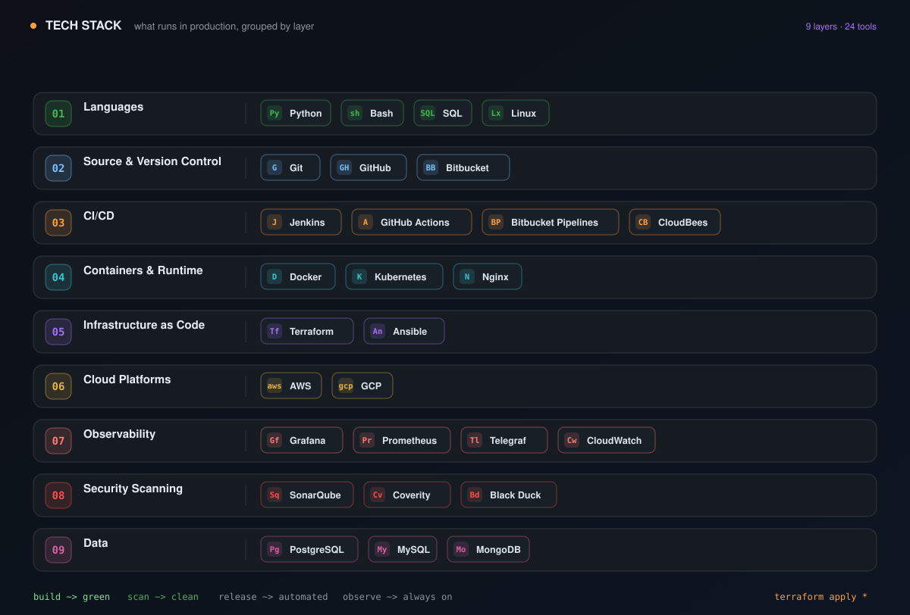

<p align="center">
  
</p>

<p align="center">
  <a href="https://github.com/shayalvaghasiya">
    
  </a>
  <a href="https://linkedin.com/in/shayalvaghasiya">
    
  </a>
  <a href="mailto:shayalvaghasiya@gmail.com">
    
  </a>
</p>

---

```
┌──────────────────────────────────────────────────┐
│  $ whoami                                        │
│  DevOps Engineer · Build & Release Automation    │
│                                                  │
│  $ pipeline status                               │
│  build ● green   test ● passing   release ● ready│
│  deploy ● live   observability ● on              │
│                                                  │
│  $ status                                        │
│  ● available for builds · uptime 99.99%          │
└──────────────────────────────────────────────────┘
```

## 🚀 About Me

DevOps Engineer with **2+ years of experience** in **build and release automation, CI/CD pipelines, and infrastructure automation** — making software delivery faster, safer, and fully observable.

I design and run build pipelines, automate release workflows, and keep delivery green — with hands-on experience maintaining 100+ Jenkins pipelines, reducing release cycle times, and building CI/CD monitoring dashboards.

## 🛠️ Tech Stack

<p align="center">
  
</p>

---

## 📊 GitHub Stats

<p align="center">
  
</p>

---

<p align="center">
  <b>Deploy early. Deploy often. Keep your builds green.</b><br/>
  <sub>Shayal Vaghasiya · DevOps Engineer</sub>
</p>
