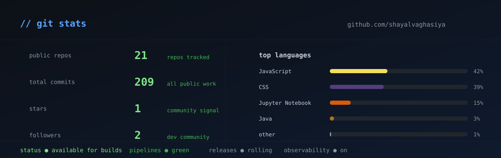

<p align="center">
  
</p>

<p align="center">
  <a href="https://github.com/shayalvaghasiya">
    
  </a>
  <a href="https://linkedin.com/in/shayalvaghasiya">
    
  </a>
  <a href="mailto:shayalvaghasiya@gmail.com">
    
  </a>
</p>

---

```
┌──────────────────────────────────────────────────┐
│  $ whoami                                        │
│  DevOps Engineer · Build & Release Automation    │
│                                                  │
│  $ pipeline status                               │
│  build ● green   test ● passing   release ● ready│
│  deploy ● live   observability ● on              │
│                                                  │
│  $ status                                        │
│  ● available for builds · uptime 99.99%          │
└──────────────────────────────────────────────────┘
```

## 🚀 About Me

DevOps Engineer focused on **build and release automation, CI/CD pipelines, and infrastructure automation** — making software delivery faster, safer, and fully observable.

I design and run build pipelines, automate release workflows, and keep delivery green. Currently deep-diving into **AWS, Terraform, Kubernetes, GitOps, and observability** — because a release pipeline only becomes legendary when it survives production.

## 💼 What I do every day

- **Build & release automation** — multi-platform builds with shorter release cycles and zero manual steps
- **CI/CD pipelines** — Jenkins, GitHub Actions, and Bitbucket Pipelines that keep deploys green
- **Release engineering** — pre-merge validation, post-merge verification, and cross-platform release builds
- **Container orchestration** — Docker for portable, reproducible builds and workloads
- **Infrastructure as Code** — Terraform and Ansible for repeatable, reviewable infrastructure
- **Observability** — Grafana, Prometheus, Telegraf, and CloudWatch to keep the dashboard honest
- **Security scanning** — Coverity, Black Duck, and SonarQube baked into every pipeline
- **Automation** — Python and Bash to eliminate manual work and reduce toil

---

## 💼 Experience

**DevOps Engineer · Build & Release Automation** — 2+ years automating CI/CD and release pipelines at scale: 100+ Jenkins pipelines, multi-platform firmware/driver release workflows, HIL testing orchestration, and CI/CD observability with Telegraf and Grafana.

---

## 📊 GitHub Stats

<p align="center">
  
</p>

---

<p align="center">
  <b>Deploy early. Deploy often. Keep your builds green.</b><br/>
  <sub>Shayal Vaghasiya · DevOps Engineer</sub>
</p>
