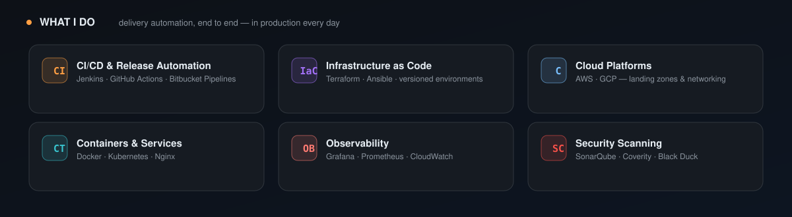

  

  
  
  
  

---

I'm a **DevOps Engineer** turning slow, manual release cycles into fast, automated, fully-observable delivery pipelines. I design, build, and run CI/CD — and keep every environment **green**.

## 🛠 Tech Stack

## ⚡ GitHub

  
  

  

---

<b>Highlights at a glance</b>

**Featured work**
- [`terraform`](https://github.com/shayalvaghasiya/terraform) — Infrastructure as Code, HCL
- [`actions-journey`](https://github.com/shayalvaghasiya/actions-journey) — CI/CD with GitHub Actions

**Certifications & training**
- AWS · GCP · Jenkins · Docker — list yours here

  <i>Automate the boring. Monitor the rest. Ship with confidence.</i> 
  Shayal Vaghasiya · DevOps Engineer · Build &amp; Release Automation

